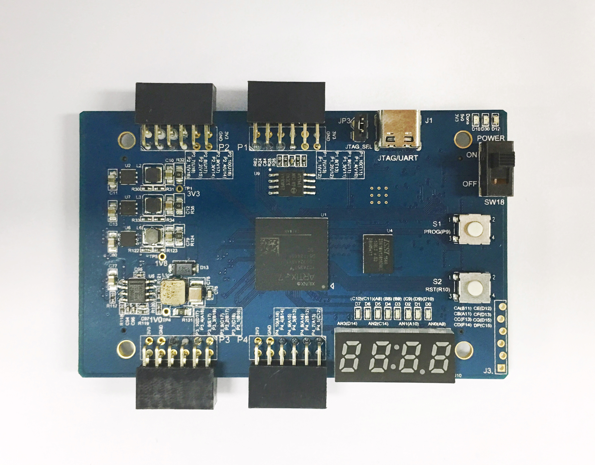

**1 概述**
~~~~~~~~~~~~
Artix-7核心板是依元素科技有限公司（E-elements）基于最新的Artix-7 FPGA研发的面向学生竞赛的数字电路开发平台。该平台提供了可靠的基础配置，节约了开发时间，丰富的扩展接口也保证了学生在创新设计上的需要。

该核心板数字电路开发平台配备的FPGA (XC7A35T-1CSG324C)具有大容量高性能等特点，能实现较复杂的数字逻辑设计，学生还可以通过在FPGA内构建一个MicroBlaze处理器进行嵌入式设计。同时核心板平台拥有基本的外设，大容量的外部存储器，以及丰富的可扩展接口能，在较大程度上满足学生竞赛需求。

Artix-7 系列FPGA在早期设计的基础上进行了优化,提供了更多的能力,更高的性能等，资源更加丰富。XC7A35T的资源如下：

* 5200个逻辑Slices，每个包含4个6输入LUT和8个触发器
* 高达450MHz的内部时钟速度
* 片上的模数转换器（XADC）
* 1800 Kbits的Block RAM
* 90个DSP48E单元
* 5个时钟管理单元，每一个都包含MMCM和PLL

核心板外设概览：

+--------+----------------------+----------+---------------+
|编号    |描述                  |编号      |描述           |
+--------+----------------------+----------+---------------+
|1       |配置电路固件下载接口  |6         |JTAG配置接口   |
+--------+----------------------+----------+---------------+
|2       |USB-UART/JTAG接口     |7         |SPI FLASH 接口 |
+--------+----------------------+----------+---------------+
|3       |4位数码管和8个LED     |8         |SRAM存储器     |
+--------+----------------------+----------+---------------+
|4       |4个PMOD 接口          |          |               |
+--------+----------------------+----------+---------------+
|5       |2个FMC接口            |                          |
+--------+----------------------+----------+---------------+

注：该核心板需要USB Type-C的连接器连接，vivado需要2017以上版本。

**2 板卡供电**
~~~~~~~~~~~~~~~~~~
核心板提多种供电方式，用户可以选用Type-C接口或FX8接口供电，板卡上提供电压转换电路将Type-C输入的5V电压转换为板卡上各类芯片需要的工作电压。上电成功后红色D9 LED灯会被点亮。

核心板提供了一个Type-C接口，可作为USB-UART/JTAG，该接口可以用于供电。使用FX8接口供电需要连接E-elements公司生产的兼容底板。

**3 时钟和复位**
~~~~~~~~~~~~~~~~~~~

核心板上搭载一个100MHz的时钟芯片，这个芯片输出的时钟信号直接与FPGA全局时钟输入引脚相连，若设计中还需要其他时钟可以FPG内部生成。板载一个外部触发按键S2，可以作为FPGA设计外部复位触发（低电位有效）。

+-------------------+-------------------+------------+
|名称               |原理图标号         |FPGA IO PIN |
+-------------------+-------------------+------------+
|时钟引脚           |SYS_CLK            |P17         |
+-------------------+-------------------+------------+
|复位引脚           |FPGA_RESET         |R10         |
+-------------------+-------------------+------------+

**4 FPGA配置**
~~~~~~~~~~~~~~~~
核心板在开始工作前必须先配置FPGA，板上提供以下方式配置FPGA：

* USB转JTAG接口J4
* 6-pin JTAG连接器接口J3
* SPI Flash上电自启动

FPGA的配置文件为后缀名.bit的文件，用户可以通过上述的三种方法将该bit文件烧写到FPGA中，该文件可以通过Vivado工具生成，BIT文件的具体功能由用户的原始设计文件决定。

在使用SPI Flash配置FPGA时，需要提前将配置文件写入到Flash中。Xilinx开发工具Vivado提供了写入Flash的功能。板上SPI Flash型号为N25Q64，支持3.3V电压配置。

FPGA配置成功后D12将点亮。

**5 通用I/O接口**
~~~~~~~~~~~~~~~~~~
核心板包含2个专用按键、8个LED、4个7段数码管。这两个专用按键分别用于逻辑复位RST和擦除FPGA配置PROG，当设计中不需要外部触发复位时，这个按键可以在其他逻辑触发功能。LED在FPGA输出高电平时才可以被点亮。数码管为共阳极数码管，即公共极输入高电平，段选端连接低电平，数码管上的对应位置才可以被点亮。共阳极由三极管驱动，FPGA需要提供反向信号。因此，FPGA输出有效的片选信号和段选信号都应该是地电平。

管脚约束如下

+----------+--------------------+----------------+------------------+
|名称      |原理图标号          |FPGA I/O Pin    |颜色              |
+----------+--------------------+----------------+------------------+
|D1        |LED1                |D10             |Green             |
+----------+--------------------+----------------+------------------+
|D2        |LED2                |D9              |Green             |
+----------+--------------------+----------------+------------------+
|D3        |LED3                |C9              |Green             |
+----------+--------------------+----------------+------------------+
|D4        |LED4                |B9              |Green             |
+----------+--------------------+----------------+------------------+
|D5        |LED5                |B8              |Green             |
+----------+--------------------+----------------+------------------+
|D6        |LED6                |A8              |Green             |
+----------+--------------------+----------------+------------------+
|D7        |LED7                |C11             |Green             |
+----------+--------------------+----------------+------------------+
|D8        |LED8                |C10             |Green             |
+----------+--------------------+----------------+------------------+
|A1        |AN1                 |D14             |Green             |
+----------+--------------------+----------------+------------------+
|A2        |AN2                 |C14             |Green             |
+----------+--------------------+----------------+------------------+
|A3        |AN3                 |A10             |Green             |
+----------+--------------------+----------------+------------------+
|A4        |AN4                 |A9              |Green             |
+----------+--------------------+----------------+------------------+
|CA        |CA                  |B11             |Green             |
+----------+--------------------+----------------+------------------+
|CB        |CB                  |A11             |Green             |
+----------+--------------------+----------------+------------------+
|CC        |CC                  |F13             |Green             |
+----------+--------------------+----------------+------------------+
|CD        |CD                  |F14             |Green             |
+----------+--------------------+----------------+------------------+
|CE        |CE                  |D12             |Green             |
+----------+--------------------+----------------+------------------+
|CF        |CF                  |D13             |Green             |
+----------+--------------------+----------------+------------------+
|CG        |CG                  |D15             |Green             |
+----------+--------------------+----------------+------------------+
|DP        |DP                  |C15             |Green             |
+----------+--------------------+----------------+------------------+

**6	USB-UART/JTAG接口**
~~~~~~~~~~~~~~~~~~~~~~~~~~~~~~~~~~~~~~~~~~~
该模块将UART/JTAG转换成USB接口。用户可以非常方便的直接采用USB线缆连接板卡与PC机USB接口，通过Xilinx的配置软件如Vivado完成对板卡的配置。同时也可以通过串口功能与上位机进行通信。

.. figure:: _static/15.png
   :width: 60%
   :align: center

+---------+---------------------+---------------------+
|名称     |原理图标号           |FPGA I/O Pin         |
+---------+---------------------+---------------------+
|UART_RX  |UART_RX              |U1（FPGA串口发送端） |
+---------+---------------------+---------------------+
|UART_TX  |UART_TX              |V1（FPGA串口接收端） |
+---------+---------------------+---------------------+

UATR的全称是通用异步收发器，是实现设备之间低速数据通信的标准协议。“异步”指不需要额外的时钟线进行数据的同步传输，双方约定在同一个频率下收发数据，此接口只需要两条信号线（RXD、TXD）就可以完成数据的相互通信，接收和发送可以同时进行，也就是全双工。

收发的过程，在发送器空闲时间，数据线处于逻辑1状态，当提示有数据要传输时，首先使数据线的逻辑状态为低，之后是8个数据位、一位校验位、一位停止位，校验一般是奇偶校验，停止位用于标示一帧的结束，接收过程亦类似，当检测到数据线变低时，开始对数据线以约定的频率抽样，完成接收过程。本例数据帧采用：无校验位，停止位为一位。

UART的数据帧格式，如下：

**7	SRAM接口**
~~~~~~~~~~~~~~~~~~~~~~~
搭载的IS61WV12816BLL-10BLI SRAM 芯片,总容量2Mbit。该SRAM异步式SRAM，最高存取时间可达8ns。操控简单，易于读写。

引脚如下：

+-------------+-------------------------+---------------+
|SRAM引脚标号 |原理图标号               |FPGA I/O Pin   |
+-------------+-------------------------+---------------+
|I/O0         |MEM_D0                   |G4             |
+-------------+-------------------------+---------------+
|I/O1         |MEM_D1                   |G3             |
+-------------+-------------------------+---------------+
|I/O2         |MEM_D2                   |J3             |
+-------------+-------------------------+---------------+
|I/O3         |MEM_D3                   |J2             |
+-------------+-------------------------+---------------+
|I/O4         |MEM_D4                   |K2             |
+-------------+-------------------------+---------------+
|I/O5         |MEM_D5                   |K1             |
+-------------+-------------------------+---------------+
|I/O6         |MEM_D6                   |H6             |
+-------------+-------------------------+---------------+
|I/O7         |MEM_D7                   |H5             |
+-------------+-------------------------+---------------+
|I/O8         |MEM_D8                   |M1             |
+-------------+-------------------------+---------------+
|I/O9         |MEM_D9                   |K3             |
+-------------+-------------------------+---------------+
|I/O10        |MEM_D10                  |L3             |
+-------------+-------------------------+---------------+
|I/O11        |MEM_D11                  |M3             |
+-------------+-------------------------+---------------+
|I/O12        |MEM_D12                  |M2             |
+-------------+-------------------------+---------------+
|I/O13        |MEM_D13                  |K5             |
+-------------+-------------------------+---------------+
|I/O14        |MEM_D14                  |L4             |
+-------------+-------------------------+---------------+
|I/O15        |MEM_D15                  |L6             |
+-------------+-------------------------+---------------+
|A00          |MEM_A00                  |B3             |
+-------------+-------------------------+---------------+
|A01          |MEM_A01                  |A1             |
+-------------+-------------------------+---------------+
|A02          |MEM_A02                  |B1             |
+-------------+-------------------------+---------------+
|A03          |MEM_A03                  |A3             |
+-------------+-------------------------+---------------+
|A04          |MEM_A04                  |A4             |
+-------------+-------------------------+---------------+
|A05          |MEM_A05                  |B4             |
+-------------+-------------------------+---------------+
|A06          |MEM_A06                  |C4             |
+-------------+-------------------------+---------------+
|A07          |MEM_A07                  |D7             |
+-------------+-------------------------+---------------+
|A08          |MEM_A08                  |E7             |
+-------------+-------------------------+---------------+
|A09          |MEM_A09                  |E5             |
+-------------+-------------------------+---------------+
|A10          |MEM_A10                  |E6             |
+-------------+-------------------------+---------------+
|A11          |MEM_A11                  |C7             |
+-------------+-------------------------+---------------+
|A12          |MEM_A12                  |D8             |
+-------------+-------------------------+---------------+
|A13          |MEM_A13                  |A5             |
+-------------+-------------------------+---------------+
|A14          |MEM_A14                  |A6             |
+-------------+-------------------------+---------------+
|A15          |MEM_A15                  |B6             |
+-------------+-------------------------+---------------+
|A16          |MEM_A16                  |B7             |
+-------------+-------------------------+---------------+
|A17          |MEM_A17                  |C5             |
+-------------+-------------------------+---------------+
|A18          |MEM_A18                  |C6             |
+-------------+-------------------------+---------------+
|OE           |SRAM_OE#                 |D4             |
+-------------+-------------------------+---------------+
|CE           |SRAM_CE#                 |E3             |
+-------------+-------------------------+---------------+
|WE           |SRAM_WE#                 |D3             |
+-------------+-------------------------+---------------+
|UB           |SRAM_UB                  |B2             |
+-------------+-------------------------+---------------+
|LB           |SRAM_LB                  |D5             |
+-------------+-------------------------+---------------+

SRAM写操作时序如下（详细请参考SRAM用户手册）：

.. figure:: _static/17.png
   :width: 60%
   :align: center

SRAM读操作时序如下（详细请参考SRAM用户手册）：

.. figure:: _static/18.png
   :width: 60%
   :align: center

**8	PMOD接口**
~~~~~~~~~~~~~~~~~~~~~~~~~~~
板上包含4个PMOD接口用于扩展核心板功能，PMOD接口常用于低频率的通信，PMOD有6插针和12插针两种模式，6插针的包含4个信号管脚、1个电源管脚和1个接地管脚，12插针的包含8信号管脚、2个电源管脚和2个接地管脚，PMOD直接连接在FPGA芯片上，使从设备由PMOD接口直接与FPGA芯片通信。

+---------------+---------------------+-----------------+
|管脚名称       |原理图标号           |FPGA I/O Pin     |
+---------------+---------------------+-----------------+
|P1_P1          |P1_1                 |V12              |
+---------------+---------------------+-----------------+
|P1_P2          |P1_2                 |U12              |
+---------------+---------------------+-----------------+
|P1_P3          |P1_3                 |V11              |
+---------------+---------------------+-----------------+
|P1_P4          |P1_4                 |V10              |
+---------------+---------------------+-----------------+
|P1_P7          |P1_7                 |U13              |
+---------------+---------------------+-----------------+
|P1_P8          |P1_8                 |T13              |
+---------------+---------------------+-----------------+
|P1_P9          |P1_9                 |U11              |
+---------------+---------------------+-----------------+
|P1_P10         |P1_10                |T11              |
+---------------+---------------------+-----------------+
|P2_P1          |P2_1                 |V16              |
+---------------+---------------------+-----------------+
|P2_P2          |P2_2                 |v15              |
+---------------+---------------------+-----------------+
|P2_P3          |P2_3                 |V14              |
+---------------+---------------------+-----------------+
|P2_P4          |P2_4                 |U14              |
+---------------+---------------------+-----------------+
|P2_P7          |P2_7                 |U18              |
+---------------+---------------------+-----------------+
|P2_P8          |P2_8                 |U17              |
+---------------+---------------------+-----------------+
|P2_P9          |P2_9                 |V17              |
+---------------+---------------------+-----------------+
|P2_P10         |P2_10                |U16              |
+---------------+---------------------+-----------------+
|P3_P1(AD2P)    |P3_1                 |B16              |
+---------------+---------------------+-----------------+
|P3_P2(AD2N)    |P3_2                 |B17              |
+---------------+---------------------+-----------------+
|P3_P3(AD11P)   |P3_3                 |B18              |
+---------------+---------------------+-----------------+
|P3_P4(AD11N)   |P3_4                 |A18              |
+---------------+---------------------+-----------------+
|P3_P7          |P3_7                 |C16              |
+---------------+---------------------+-----------------+
|P3_P8          |P3_8                 |C17              |
+---------------+---------------------+-----------------+
|P3_P9          |P3_9                 |E17              |
+---------------+---------------------+-----------------+
|P3_P10         |P3_10                |D17              |
+---------------+---------------------+-----------------+
|P4_P1(AD1P)    |P4_1                 |C12              |
+---------------+---------------------+-----------------+
|P4_P2(AD1N)    |P4_2                 |B12              |
+---------------+---------------------+-----------------+
|P4_P3(AD8P)    |P4_3                 |B13              |
+---------------+---------------------+-----------------+
|P4_P4(AD8N)    |P4_4                 |B14              |
+---------------+---------------------+-----------------+
|P4_P7(AD3P)    |P4_7                 |A13              |
+---------------+---------------------+-----------------+
|P4_P8(AD3N)    |P4_8                 |A14              |
+---------------+---------------------+-----------------+
|P4_P9(AD10P)   |P4_9                 |A15              |
+---------------+---------------------+-----------------+
|P4_P10(AD10N)  |P4_10                |A16              |
+---------------+---------------------+-----------------+

**9 FX8接口**
~~~~~~~~~~~~~~~~~~
核心板提供了两个FX8接口用于扩展平台与外界通信的信号，接口上大部分信号直接与FPGA连接，另一部分信号用于为板卡供电。

FX8的链接器的IO并没有全部使用。详见下表

+----------+--------+--------+----------+---------+---------+
|FX8-J5-L  |NET     |LOC     |FX8-J5-R  |NET      |LOC      |
+----------+--------+--------+----------+---------+---------+
|J5_1      |+5.0V   |+5.0V   |J5_2      |+5.0V    |+5.0V    |
+----------+--------+--------+----------+---------+---------+
|J5_3      |+5.0V   |+5.0V   |J5_4      |+5.0V    |+5.0V    |
+----------+--------+--------+----------+---------+---------+
|J5_5      |+3.3V   |+3.3V   |J5_6      |+1.8V    |+1.8V    |
+----------+--------+--------+----------+---------+---------+
|J5_7      |+3.3V   |+3.3V   |J5_8      |+1.8V    |+1.8V    |
+----------+--------+--------+----------+---------+---------+
|J5_9      |VCCO_34 |VCCO_34 |J5_10     |VCCO_34  |VCCO_34  |
+----------+--------+--------+----------+---------+---------+
|J5_11     |VCCO34  |VCCO_34 |J5_12     |VCC0_34  |VCCO_34  |
+----------+--------+--------+----------+---------+---------+
|J5_13     |GND     |GND     |J5_14     |GND      |GND      |
+----------+--------+--------+----------+---------+---------+
|J5_15     |GND     |GND     |J5_16     |GND      |GND      |
+----------+--------+--------+----------+---------+---------+
|J5_17     |0_14    |R11     |J5_18     |L5P_14   |R12      |
+----------+--------+--------+----------+---------+---------+
|J5_19     |L24P_14 |T9      |J5_20     |L5N_14   |R13      |
+----------+--------+--------+----------+---------+---------+
|J5_21     |L24N_14 |T10     |J5_22     |L15P_14  |R16      |
+----------+--------+--------+----------+---------+---------+
|J5_23     |L14P_14 |T14     |J5_24     |L15N_14  |T16      |
+----------+--------+--------+----------+---------+---------+
|J5_25     |L14N_14 |T15     |J5_26     |L13P_14  |P15      |
+----------+--------+--------+----------+---------+---------+
|J5_27     |L7P_14  |R18     |J5_28     |L13N_14  |R15      |
+----------+--------+--------+----------+---------+---------+
|J5_29     |L7N_14  |T18     |J5_30     |L11P_14  |N15      |
+----------+--------+--------+----------+---------+---------+
|J5_31     |L8P_14  |N14     |J5_32     |L11N_14  |N16      |
+----------+--------+--------+----------+---------+---------+
|J5_33     |L8N_14  |P14     |J5_34     |L2P_14   |L14      |
+----------+--------+--------+----------+---------+---------+
|J5_35     |L9P_14  |N17     |J5_36     |L2N_14   |M14      |
+----------+--------+--------+----------+---------+---------+
|J5_37     |L9N_14  |P18     |J5_38     |L10P_14  |M16      |
+----------+--------+--------+----------+---------+---------+  
|J5_39     |L3P_14  |L15     |J5_40     |L10N_14  |M17      |
+----------+--------+--------+----------+---------+---------+
|J5_41     |L3N_14  |L16     |J5_42     |         |         |
+----------+--------+--------+----------+---------+---------+
|J5_43     |L4P_14  |L18     |J5_44     |         |         |
+----------+--------+--------+----------+---------+---------+
|J5_45     |L4N_14  |M18     |J5_46     |L13P_15  |H16      |
+----------+--------+--------+----------+---------+---------+
|J5_47     |L6P_14  |M13     |J5_48     |L13N_15  |G16      |
+----------+--------+--------+----------+---------+---------+
|J5_49     |L12N_14 |R17     |J5_50     |25_15    |K16      |
+----------+--------+--------+----------+---------+---------+
|J5_51     |O_15    |G13     |J5_52     |L24P_15  |K15      |
+----------+--------+--------+----------+---------+---------+
|J5_53     |L23P_15 |J17     |J5_54     |L24N_15  |J15      |
+----------+--------+--------+----------+---------+---------+
|J5_55     |L23N_15 |J18     |J5_56     |L18P_15  |H17      |
+----------+--------+--------+----------+---------+---------+
|J5_57     |L17P_15 |K13     |J5_58     |L18N_15  |G17      |
+----------+--------+--------+----------+---------+---------+
|J5_59     |L17N_15 |J13     |J5_60     |L19P_15  |J14      |
+----------+--------+--------+----------+---------+---------+
|J5_61     |L15P_15 |H14     |J5_62     |L19N_15  |H15      |
+----------+--------+--------+----------+---------+---------+
|J5_63     |L15N_15 |G14     |J5_64     |L22P_15  |G18      |
+----------+--------+--------+----------+---------+---------+
|J5_65     |L14P_15 |F15     |J5_66     |L22N_15  |F18      |
+----------+--------+--------+----------+---------+---------+
|J5_67     |L14N_15 |F16     |J5_68     |         |         |
+----------+--------+--------+----------+---------+---------+
|J5_69     |L11P_15 |E15     |J5_70     |         |         |
+----------+--------+--------+----------+---------+---------+
|J5_71     |L11N_15 |E16     |J5_72     |         |         |
+----------+--------+--------+----------+---------+---------+
|J5_73     |L21P_15 |E18     |J5_74     |         |         |
+----------+--------+--------+----------+---------+---------+
|J5_75     |L21N_15 |D18     |J5_76     |         |         |
+----------+--------+--------+----------+---------+---------+
|J5_77     |GDN     |GND     |J5_78     |GND      |GND      |
+----------+--------+--------+----------+---------+---------+
|J5_79     |GND     |GND     |J5_80     |GND      |GND      |
+----------+--------+--------+----------+---------+---------+
|FX8-J6-L  |NET     |LOC     |FX8-J6-R  |NET      |LOC      |
+----------+--------+--------+----------+---------+---------+
|J6_1      |+5.0V   |+5.0V   |J6_2      |+5.0V    |+5.0V    |
+----------+--------+--------+----------+---------+---------+
|J6_3      |+5.0V   |+5.0V   |J6_4      |+5.0V    |5.0V     |
+----------+--------+--------+----------+---------+---------+
|J6_5      |+3.3V   |+3.3V   |J6_6      |+1.8V    |+1.8V    |
+----------+--------+--------+----------+---------+---------+
|J6_7      |+3.3V   |3.3V    |J6_8      |+1.8V    |+1.8V    |
+----------+--------+--------+----------+---------+---------+
|J6_9      |VCCO_35 |VCCO_35 |J6_10     |VCCO_35  |VCCO_35  |
+----------+--------+--------+----------+---------+---------+
|J6_11     |VCCO_35 |VCCO_35 |J6_12     |VCCO_35  |VCCO_35  |
+----------+--------+--------+----------+---------+---------+
|J6_13     |GND     |GND     |J6_14     |GND      |GND      |
+----------+--------+--------+----------+---------+---------+
|J6_15     |GND     |GND     |J6_16     |GND      |GND      |
+----------+--------+--------+----------+---------+---------+
|J6_17     |L24P_34 |R8      |J6_18     |L21P_34  |U9       |
+----------+--------+--------+----------+---------+---------+
|J6_19     |L24N_34 |T8      |J6_20     |L21N34   |V9       |
+----------+--------+--------+----------+---------+---------+
|J6_21     |L22P_34 |U7      |J6_22     |25_34    |U8       |
+----------+--------+--------+----------+---------+---------+
|J6_23     |L22N_34 |U6      |J6_24     |L20P_34  |V7       |
+----------+--------+--------+----------+---------+---------+
|J6_25     |L23P_34 |R7      |J6_26     |L20N_34  |V6       |
+----------+--------+--------+----------+---------+---------+
|J6_27     |L23N_34 |T6      |J6_28     |L10P_34  |V5       |
+----------+--------+--------+----------+---------+---------+
|J6_29     |L12P_34 |T5      |J6_30     |L10N_34  |V4       |
+----------+--------+--------+----------+---------+---------+
|J6_31     |L12N_34 |T4      |J6_32     |L9P_34   |U2       |
+----------+--------+--------+----------+---------+---------+
|J6_33     |L8P_34  |U4      |J6_34     |L9N_34   |V2       |
+----------+--------+--------+----------+---------+---------+
|J6_35     |L8N_34  |U3      |J6_36     |L19P_34  |R6       |
+----------+--------+--------+----------+---------+---------+
|J6_37     |L11P_34 |R3      |J6_38     |L19N_34  |R5       |
+----------+--------+--------+----------+---------+---------+
|J6_39     |L11N_34 |T3      |J6_40     |L17P_34  |R1       |
+----------+--------+--------+----------+---------+---------+
|J6_41     |L3P_34  |N2      |J6_42     |L17N_34  |T1       |
+----------+--------+--------+----------+---------+---------+
|J6_43     |L3N_34  |N1      |J6_44     |L18P_34  |M6       |
+----------+--------+--------+----------+---------+---------+
|J6_45     |L13P_34 |N5      |J6_46     |L18N_34  |N6       |
+----------+--------+--------+----------+---------+---------+
|J6_47     |L13N_34 |P5      |J6_48     |L15P_34  |P2       |
+----------+--------+--------+----------+---------+---------+
|J6_49     |L14P_34 |P4      |J6_50     |L15N_34  |R2       |
+----------+--------+--------+----------+---------+---------+
|J6_51     |L14N_34 |P3      |J6_52     |0_34     |K6       |
+----------+--------+--------+----------+---------+---------+
|J6_53     |L17P_34 |H1      |J6_54     |L16P_34  |M4       |
+----------+--------+--------+----------+---------+---------+
|J6_55     |L17N_34 |G1      |J6_56     |L16N_34  |N4       |
+----------+--------+--------+----------+---------+---------+
|J6_57     |L18P_34 |F1      |J6_58     |L1P_34   |L1       |
+----------+--------+--------+----------+---------+---------+
|J6_59     |L18N_34 |E1      |J6_60     |L6N_34   |L5       |
+----------+--------+--------+----------+---------+---------+
|J6_61     |L14P_35 |E2      |J6_62     |L21P_35  |J4       |
+----------+--------+--------+----------+---------+---------+
|J6_63     |L14N_35 |D2      |J6_64     |L21N_35  |H4       |
+----------+--------+--------+----------+---------+---------+
|J6_65     |L16P_35 |C2      |J6_66     |L15P_35  |H2       |
+----------+--------+--------+----------+---------+---------+
|J6_67     |L16N_35 |C1      |J6_68     |L15N_35  |G2       |
+----------+--------+--------+----------+---------+---------+
|J6_69     |0_35    |F5      |J6_70     |L19P_35  |G6       |
+----------+--------+--------+----------+---------+---------+
|J6_71     |25_35   |J5      |J6_72     |L19N_35  |F6       |
+----------+--------+--------+----------+---------+---------+
|J6_73     |        |        |J6_74     |L13P_35  |F4       |
+----------+--------+--------+----------+---------+---------+
|J6_75     |        |        |J6_76     |L13N_35  |F3       |
+----------+--------+--------+----------+---------+---------+
|J6_77     |GND     |GND     |J6_78     |GND      |GND      |
+----------+--------+--------+----------+---------+---------+
|J6_79     |GND     |GND     |J6_80     |GND      |GND      |
+----------+--------+--------+----------+---------+---------+

**10 EES353（底板）**
~~~~~~~~~~~~~~~~~~~~~~

**10.1 概述**
>>>>>>>>>>>>>>>
EES-353是依元素科技研制的可兼容基于A7的核心板EES-303的底板。该底板具有4个PMOD接口，2组2×23p的双排母接口用于IO功能扩展。产品外观如下图所示。

对应的各功能接插件如下表所示：

+-------------+---------------------------+---------------------------+
|编号         |描述                       |位号                       |
+-------------+---------------------------+---------------------------+
|1            |2个FX8接插件               |J5、J6                     |
+-------------+---------------------------+---------------------------+
|2            |4个PMOD接口                |P1、P2、P3、P4             |
+-------------+---------------------------+---------------------------+
|3            |2个2x23p的排母             |J7、J8                     |
+-------------+---------------------------+---------------------------+
|4            |DC电源输入接口             |J3                         |
+-------------+---------------------------+---------------------------+
|5            |microUSB接口供电           |J1                         |
+-------------+---------------------------+---------------------------+

EES353和EES303配合使用示意图如下图所示：

**10.2 注意事项**
>>>>>>>>>>>>>>>>>>
在EES-353的使用过程中，要特别注意以下几点：

* 工作电压不超过5V，以免烧坏；
* Fx8、PMOD等所有接插件的部分PIN脚为电源和GND，使用时应避免短路造成核心板损坏。
* J1的microUSB可用于供电，不可用于USB信号传输。

**10.3 与A7核心板互联时管脚信号对应连接关系**
>>>>>>>>>>>>>>>>>>>>>>>>>>>>>>>>>>>>>>>>>>>>>>>

底板EES353与EES303对扣互联后，353上J8的第8个pin脚与J5中第18个pin脚相连，对应的FPGA的管脚为R12。

**10.4 底板EES353的内部接口映射关系表**
>>>>>>>>>>>>>>>>>>>>>>>>>>>>>>>>>>>>>>>>>>>>

+----+-------+----+-------+----+-------+----+-------+
|J5  |       |    |       |J6  |       |    |       |
+----+-------+----+-------+----+-------+----+-------+
|序号|信号名 |序号|信号名 |序号|信号名 |序号|信号名 |
+----+-------+----+-------+----+-------+----+-------+
|1   |5.0V   |2   |5.0V   |1   |5.0V   |2   |5.0V   |
+----+-------+----+-------+----+-------+----+-------+
|3   |5.0V   |4   |5.0V   |3   |5.0V   |4   |5.0V   |
+----+-------+----+-------+----+-------+----+-------+
|5   |3.3V   |6   |NC     |5   |3.3V   |6   |NC     |
+----+-------+----+-------+----+-------+----+-------+
|7   |3.3V   |8   |NC     |7   |3.3V   |8   |NC     |
+----+-------+----+-------+----+-------+----+-------+
|9   |NC     |10  |NC     |9   |NC     |10  |NC     |
+----+-------+----+-------+----+-------+----+-------+
|11  |NC     |12  |NC     |11  |NC     |12  |NC     |
+----+-------+----+-------+----+-------+----+-------+
|13  |GND    |14  |GND    |13  |GND    |14  |GND    |
+----+-------+----+-------+----+-------+----+-------+
|15  |GND    |16  |GND    |15  |GND    |16  |GND    |
+----+-------+----+-------+----+-------+----+-------+
|17  |J8-7   |18  |J8-8   |17  |J7-7   |18  |J7-8   |
+----+-------+----+-------+----+-------+----+-------+
|19  |J8-9   |20  |J8-10  |19  |J7-9   |20  |J7-10  |
+----+-------+----+-------+----+-------+----+-------+
|21  |J8-11  |22  |J8-12  |21  |J7-11  |22  |J7-12  |
+----+-------+----+-------+----+-------+----+-------+
|23  |J8-13  |24  |J8-14  |23  |J7-13  |24  |J7-14  |
+----+-------+----+-------+----+-------+----+-------+
|25  |J8-15  |26  |J8-16  |25  |J7-15  |26  |J7-16  |
+----+-------+----+-------+----+-------+----+-------+
|27  |J8-17  |28  |J8-18  |27  |J7-17  |28  |J7-18  |
+----+-------+----+-------+----+-------+----+-------+
|29  |J8-19  |30  |J8-20  |29  |J7-19  |30  |J7-20  |
+----+-------+----+-------+----+-------+----+-------+
|31  |J8-21  |32  |J8-22  |31  |J7-21  |32  |J7-22  |
+----+-------+----+-------+----+-------+----+-------+
|33  |J8-23  |34  |J8-24  |33  |J7-23  |34  |J7-24  |
+----+-------+----+-------+----+-------+----+-------+
|35  |J8-25  |36  |J8-26  |35  |J7-25  |36  |J7-26  |
+----+-------+----+-------+----+-------+----+-------+
|37  |J8-27  |38  |J8-28  |37  |J7-27  |38  |J7-28  |
+----+-------+----+-------+----+-------+----+-------+
|39  |J8-29  |40  |J8-30  |39  |J7-29  |40  |J7-30  |
+----+-------+----+-------+----+-------+----+-------+
|41  |J8-35  |42  |J8-31  |41  |J7-31  |42  |J7-32  |
+----+-------+----+-------+----+-------+----+-------+
|43  |J8-37  |44  |J8-32  |43  |J7-33  |44  |J7-34  |
+----+-------+----+-------+----+-------+----+-------+
|45  |J8-39  |46  |J8-33  |45  |J7-35  |46  |J7-36  |
+----+-------+----+-------+----+-------+----+-------+
|47  |J8-41  |48  |J8-34  |47  |J7-37  |48  |J7-38  |
+----+-------+----+-------+----+-------+----+-------+
|49  |P4-4   |50  |J8-36  |49  |J7-39  |50  |J7-40  |
+----+-------+----+-------+----+-------+----+-------+
|51  |P4-10  |52  |J8-38  |51  |J7-41  |52  |J7-42  |
+----+-------+----+-------+----+-------+----+-------+
|53  |P4-9   |54  |J8-40  |53  |P3-1   |54  |P1-3   |
+----+-------+----+-------+----+-------+----+-------+
|55  |P4-3   |56  |J8-42  |55  |P3-7   |56  |P1-9   |
+----+-------+----+-------+----+-------+----+-------+
|57  |P4-2   |58  |P2-4   |57  |P3-2   |58  |P1-4   |
+----+-------+----+-------+----+-------+----+-------+
|59  |P4-8   |60  |P2-10  |59  |P3-8   |60  |P1-10  |
+----+-------+----+-------+----+-------+----+-------+
|61  |P4-7   |62  |P2-3   |61  |P3-3   |62  |P1-1   |
+----+-------+----+-------+----+-------+----+-------+
|63  |P4-1   |64  |P2-9   |63  |P3-9   |64  |P1-7   |
+----+-------+----+-------+----+-------+----+-------+
|65  |P2-7   |66  |P2-1   |65  |P3-4   |66  |P1-2   |
+----+-------+----+-------+----+-------+----+-------+
|67  |P2-2   |68  |NC     |67  |P3-10  |68  |NC     |
+----+-------+----+-------+----+-------+----+-------+
|69  |P2-8   |70  |NC     |69  |P1-8   |70  |NC     |
+----+-------+----+-------+----+-------+----+-------+
|71  |NC     |72  |NC     |71  |NC     |72  |NC     |
+----+-------+----+-------+----+-------+----+-------+
|73  |NC     |74  |NC     |73  |NC     |74  |NC     |
+----+-------+----+-------+----+-------+----+-------+
|75  |NC     |76  |NC     |75  |NC     |76  |NC     |
+----+-------+----+-------+----+-------+----+-------+
|77  |GND    |78  |GND    |77  |GND    |78  |GND    |
+----+-------+----+-------+----+-------+----+-------+
|79  |GND    |80  |GND    |79  |GND    |80  |GND    |
+----+-------+----+-------+----+-------+----+-------+

**11 参考资料**
~~~~~~~~~~~~~~~~~

推荐参考教材

   
**12 参考设计**
~~~~~~~~~~~~~~~~~~~

参考案例请参考EGo1，链接：

http://e-elements.readthedocs.io/zh/ego1_v2.1/EGo1_demo.html

**13 参考工程与文档**
~~~~~~~~~~~~~~~~~~~~~~~~~

A-7核心板SRAM读写demo，链接：

https://pan.baidu.com/s/1dFgxaJB

A-7核心板系列案例：基于OV7670的摄像头采集与VGA，链接：

https://pan.baidu.com/s/1kViSAPL

A7核心板系列案例—— 扩展传感器模块的控制器扩展案例，链接：

https://pan.baidu.com/s/1dFjKMlz

**14 竞赛与创新案例**
~~~~~~~~~~~~~~~~~~~~~~~~~
2017 全国大学生电子设计竞赛全国一等奖作品

   

   
2016 江苏省FPGA设计竞赛获奖作品

   

   

   
其他竞赛获奖作品及竞赛

