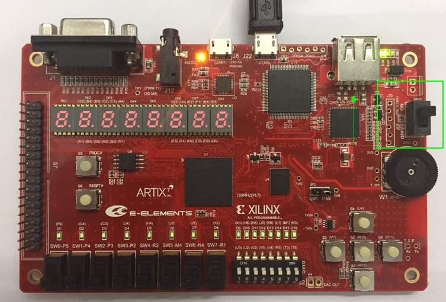

**Getting start** 
==================

**1 EGo1板卡使用注意事项**
---------------------------
**EGo1板卡使用必读**
~~~~~~~~~~~~~~~~~~~~~~~~~~~

每次操作EGo1板卡之前，人体应短暂接地(例如用手摸一下接地的金属导体)以泄露身上的静电荷。或者使用专用防静电工具，例如防静电手环，如下图所示。

**EGo1板卡图示**
~~~~~~~~~~~~~~~~~~

**使用流程**
~~~~~~~~~~~~~~~~~~~~
1、用usb线的一端插入EGo1板卡USB-UART/JTAG端口，另一端插入电脑。然后打开电源开关。（Usb插拔注意：轻插轻拔，一定不能垂直于板卡方向扭动，否则usb口容易松动甚至脱落。）

2、打开vivado开发工具，选择Open Hardware Manager，如图所示。

3、在 “Hardware Manager” 界面点击 “Open target”, 选择 “Auto Connect”。

4、连接成功后，在目标芯片上右击，选择“Program Device”。

5、在弹出的对话框中 “Bitstream File” 一栏中加载需要下载的bitstream文件，点击 “Program” 对FPGA芯片进行编程。

**2 EGo1板卡测试流程**
--------------------------
**工具准备**
~~~~~~~~~~~~~~~~~~~~~~
* USB-Type C数据线
* VGA显示器、耳机、示波器、USB键盘
* 16个跳帽或2*16短接器
* PC一台，预装串口终端工具（如Putty、TeraTerm）、Vivado2015.4
* Android手机，预装BLE蓝牙串口应用
**测试流程**
~~~~~~~~~~~~~~~~~
（板卡测试bin文件下载：https://pan.baidu.com/s/1n8wa8zFTRdLifM6wvngWvQ）

1. 板卡上电

 a) 操作前确保电源拨至OFF处。
  
 b) 使用USB线连接板卡至PC，确认连接无误，给板卡上电。

2. 等待板卡上D18和D30两个LED灯常亮后，此时会在设备管理器中识别到板卡串口（在后面会需要此端口号）。

3. 烧写Flash   （注：新出厂的EGO1已经预先烧好测试文件，可以省略此步骤）

 a)	打开Vivado→Open Hardware Manager→Open Target→Auto Connect连接板卡；
	
 b)	选中芯片型号然后右键Add Configuration Memory Device→选择Flash型号为N25Q64-3.3V→OK，然后弹出对话框再次点击“OK”；
	
 c)	在“Program Configuration Memory Device”选项卡中，将BIN文件添加到Configuration File，BIN文件目录..\EGO1_test\bin\EGO1_BIST_35T.bin，然后点击“OK”等待烧写完成。

4.	从Flash启动
	a)	给板卡断电，确认将JP2跳线选择到QSPI启动；
	b)	给板卡上电，等待配置完成，配置完成后LED灯D24点亮；

5.	双击打开串口终端  ，波特率设为9600，数据为8-Bit，无奇偶校验，停止位为1-Bit，无流控。（注：此处设备端口号以设备管理器中显示的端口号为准。）

6.	按下S5_PROG#按键，重新配置FPGA，根据串口终端输出提示进行外设测试，测试菜单目录如下;

	

.. toctree::
   :maxdepth: 2

