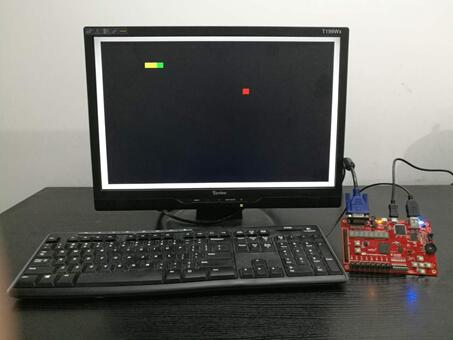

**Ego1_demo** 
==================   
（Bit文件下载链接：http://pan.baidu.com/s/1dF04v65）
 
**EGo1_demo_01实验说明**
------------------------
**游戏规则**
~~~~~~~~~~~~
该实验为贪吃蛇游戏，玩家使用方向键操控一条长长的蛇不断吞下苹果，同时蛇身随着吞下的苹果不断变长，当蛇头撞到蛇身或障壁时游戏结束。键盘中WSAD分别控制上下左右，EGo1板上最左边的按键是复位键(P15)，此时按WSAD均可使游戏开始，若碰壁则蛇身闪烁，游戏结束，当达到胜利条件（蛇身长16）时，蛇身闪烁，代表胜利。按下复位键，游戏重新开始。

**操作步骤**
~~~~~~~~~~~~
1.打开vivado工具，选择“Open Hardware Manager”。

2.用 Micro USB 线连接电脑与板卡上的 JTAG 端口，用VGA线连接板卡与显示器，将键盘上的USB线插到板卡的USB-PS/2端口，然后打开电源开关。在 “Hardware  Manager” 界面点击 “Open target”， 选择 “Auto Connect”。

3.连接成功后， 在目标芯片上右击，选择 “Program Device”。

4.在弹出的对话框“Bitstream File” 一栏中加载此实验的bit文件，点击 “Program” 对 FPGA 芯片进行编程。

5.按WSAD键均可使游戏开始，当蛇头撞到蛇身或障壁时蛇身闪烁，代表游戏结束，按一下板卡上的复位键，游戏重新开始。当蛇身长16时，蛇身闪烁，代表胜利。

**硬件演示示意图**
~~~~~~~~~~~~~~~~~~

**EGo1_demo_02实验说明**
------------------------
**游戏规则**
~~~~~~~~~~~~
该实验为躲避障碍物游戏，屏幕显示640*480的像素块，四个160*10的障碍物从顶部以不同速度下落，每次下落下降10个像素点。物块为20*20的像素点，可以通过键盘WSAD控制向上下左右四个方向移动，躲避障碍物。障碍物接触到物块为输，屏幕显示为白底黑色的L ；物块移动到屏幕的指定位置（屏幕的最上方一行）为胜。屏幕显示为白底粉色的大V。按下板子上最左边的刷新键(P15)，游戏重新开始。

**操作步骤**
~~~~~~~~~~~~
1.打开vivado工具，选择“Open Hardware Manager”。

2.用 Micro USB线连接电脑与板卡上的 JTAG 端口，用VGA线连接板卡与显示器，将键盘上的USB线插到板卡的USB-PS/2端口，然后打开电源开关。在 “Hardware  Manager” 界面点击 “Open target”， 选择 “Auto Connect”。

3.连接成功后， 在目标芯片上右击，选择 “Program Device”。

4.在弹出的对话框“Bitstream File” 一栏中加载此实验的bit文件，点击 “Program” 对 FPGA 芯片进行编程。

5.通过键盘WSAD控制上下左右四个方向移动，躲避障碍物。障碍物接触到物块为输，屏幕显示为白底黑色的L，按下板子上最左边的刷新键(P15)，游戏重新开始。当物块移动到屏幕的最上方一行为胜，屏幕显示为白底粉色的大V。

**硬件演示示意图**
~~~~~~~~~~~~~~~~~~

**EGo1_demo_03实验说明**
------------------------
**游戏规则**
~~~~~~~~~~~~
该实验为五子棋游戏，可以实现五子棋双人对弈，S4(U4)、S1(R17)、S3(V1)、S0(R11)分别控制上下左右方向，S2(R15)控制落子。黑棋先走，任何一方先连成五个，会在棋盘的右面显示WIN界面。

**操作步骤**
~~~~~~~~~~~~
1.打开vivado工具，选择“Open Hardware Manager”。

2.用 Micro USB线连接电脑与板卡上的 JTAG 端口，用VGA线连接板卡与显示器，然后打开电源开关。在 “Hardware  Manager” 界面点击 “Open target”， 选择 “Auto Connect”。

3.连接成功后， 在目标芯片上右击，选择 “Program Device”。

4.在弹出的对话框“Bitstream File” 一栏中加载此实验的bit文件，点击 “Program” 对 FPGA 芯片进行编程。

5.用S4(U4)、S1(R17)、S3(V1)、S0(R11)分别控制上下左右方向，S2(R15)控制落子。黑棋先走，任何一方先连成五个，会在棋盘的右面显示WIN界面。

**硬件演示示意图**
~~~~~~~~~~~~~~~~~~

**EGo1_demo_04实验说明**
------------------------
**游戏规则**
~~~~~~~~~~~~
该实验为奔跑的方块游戏，游戏中玩家通过Ego1开发板上的S2(R15)键控制一个方块上下移动，跨越由各种不同长度柱子所组成的障碍。每关障碍由两个柱子组成，柱子的高度都不同，因而每一关的缝隙宽度也不相等，增加了游戏难度的随机性。位于右边的能量槽作为本游戏的计分手段，每正确通过一个障碍将会增加一格能量，能量集满时玩家胜利，屏幕出现“√”。方块触碰屏幕上界或下界或水管障碍将会判定失败，游戏重置，屏幕出现“×”。按下S0(R11)键，游戏重新开始。

**操作步骤**
~~~~~~~~~~~~
1.打开vivado工具，选择“Open Hardware Manager”。

2.用 Micro USB线连接电脑与板卡上的 JTAG 端口，用VGA线连接板卡与显示器，然后打开电源开关。在 “Hardware  Manager” 界面点击 “Open target”， 选择 “Auto Connect”。

3.连接成功后， 在目标芯片上右击，选择 “Program Device”。

4.在弹出的对话框“Bitstream File” 一栏中加载此实验的bit文件，点击 “Program” 对 FPGA 芯片进行编程。

5.按一下S0(R11)键，游戏开始。通过2(R15)键控制一个方块上下移动，跨越由各种不同长度柱子所组成的障碍。每正确通过一个障碍将会增加一格能量，能量集满时玩家胜利，屏幕出现“√”。方块触碰屏幕上界或下界或水管障碍将会判定失败，游戏重置，屏幕出现“×”。按一下S0(R11)键，游戏重新开始。

**硬件演示示意图**
~~~~~~~~~~~~~~~~~~

**EGo1_demo_05实验说明**
-------------------------
**游戏规则**
~~~~~~~~~~~~
该实验为弹珠实验，一人使用Ego1开发板上的S3(V1)和S0(R11)按键控制下面弹板的左移和右移，另一人通过键盘上右边的数字键4和6控制上面弹板的左移和右移。弹板可以左右移动，目的是防止小球弹出界面。小球在哪方出界判该方为输。按下EGo1开发板上的S2(R15),游戏会重新开始。

**操作步骤**
~~~~~~~~~~~~
1.打开vivado工具，选择“Open Hardware Manager”。

2.用 Micro USB 线连接电脑与板卡上的 JTAG 端口，用VGA线连接板卡与显示器，将键盘上的USB线插到板卡的USB-PS/2端口，然后打开电源开关。在 “Hardware  Manager” 界面点击 “Open target”， 选择 “Auto Connect”。

3.连接成功后， 在目标芯片上右击，选择 “Program Device”。

4.在弹出的对话框“Bitstream File” 一栏中加载此实验的bit文件，点击 “Program” 对 FPGA 芯片进行编程。

5.按一下S2(R15)，游戏开始，一人使用Ego1开发板上的S3(V1)和S0(R11)按键控制下面弹板的左移和右移，另一人通过键盘上右边的数字键4和6控制上面弹板的左移和右移。小球在哪方出界判该方为输。再按一下S2(R15)，游戏会重新开始。

**硬件演示示意图**
~~~~~~~~~~~~~~~~~~

**EGo1_demo_06实验说明**
------------------------
**实验介绍**
~~~~~~~~~~~~
该实验为VGA图像显示实验，在 EGo1数模混合口袋实验平台上通过 VGA 接口显示图片，VGA 控制器采用 640×480@60Hz 的标准， 要显示的 Logo 图案预先存储在 ROM 中。最终显示效果为 Logo 图片在显示器上游动，到达边界自动反弹。

**操作步骤**
~~~~~~~~~~~~
1.打开vivado工具，选择“Open Hardware Manager”。

2.用 Micro USB线连接电脑与板卡上的 JTAG 端口，用VGA线连接板卡与显示器，然后打开电源开关。在 “Hardware  Manager” 界面点击 “Open target”， 选择 “Auto Connect”。

3.连接成功后， 在目标芯片上右击，选择 “Program Device”。

4.在弹出的对话框“Bitstream File” 一栏中加载此实验的bit文件，点击 “Program” 对 FPGA 芯片进行编程。

5.logo图片在显示器上游动，到达边界后自动反弹。按下S6(P15)后，图片消失。

**硬件演示示意图**
~~~~~~~~~~~~~~~~~~

**EGo1_demo_07实验说明**
------------------------
**实验介绍**
~~~~~~~~~~~~
该实验为音频实验，EGo1 开发板上搭载了一个3.5mm的音频输出接口，音频接口采用了两颗AD8891ART模数转换芯片，该芯片能把声音信号转换为相应的电平信号。

**操作步骤**
~~~~~~~~~~~~
1.打开vivado工具，选择“Open Hardware Manager”。

2.用 Micro USB线连接电脑与板卡上的 JTAG 端口，用VGA线连接板卡与显示器，然后打开电源开关。在 “Hardware  Manager” 界面点击 “Open target”， 选择 “Auto Connect”。

3.连接成功后， 在目标芯片上右击，选择 “Program Device”。

4.在弹出的对话框“Bitstream File” 一栏中加载此实验的bit文件，点击 “Program” 对 FPGA 芯片进行编程。

5.下载完成后可以在显示器上看到红绿相间的条纹，然后闭合SW0(P5)和DIP_SW0(U3),将耳机插入音频输出接口，可以听到音乐。

**硬件演示示意图**
~~~~~~~~~~~~~~~~~~

**EGo1_demo_08实验说明**
------------------------
**实验介绍**
~~~~~~~~~~~~
该实验为蓝牙实验，本实验利用了板卡上的蓝牙模块与外界支持蓝牙 4.0 标准的设备（如手机）进行交互。该蓝牙模块出厂默认配置为通过串口协议与 FPGA 进行通信，用户无需研究蓝牙相关协议与标准，只需要按照 UART 串口通信协议来处理发送与接收的数据即可。在这个设计中，我们在串口协议基础上自定义了若干控制命令，以便于在远端设备上可以通过蓝牙对 FPGA 平台上的逻辑、外设以及接口进行控制。例如在这里我们自定义了如下命令： 命令 1： *Naaaa 命令 2： *Waaaaaaaa。其中，星号（ *）用作命令的起始位， N、 W 等大写字母作为命令的名称， 小写字母 a表示任意一个十六进制数。 命令 N 后接四位十六进制数即 16bit 数据，命令 W 后接八位十六进制数即 32bit 数据。
在实验中，我们定义命令 N 用于点亮板卡的 LED，其后接 16bit 数据分别对应板卡上 16位 LED 灯；定义命令 W 用于控制七段数码管显示，其后接 32bit 数据分别对应板卡上 8 位七段数码管显示器的数值。 用户可以自定义命令的功能， 或将命令后接的数据用作其它用途。此外， 用户还可以在此基础上定义新的命令。

**操作步骤**
~~~~~~~~~~~~
1.打开vivado工具，选择“Open Hardware Manager”。

2.用 Micro USB线连接电脑与板卡上的 JTAG 端口，然后打开电源开关。在 “Hardware  Manager” 界面点击 “Open target”， 选择 “Auto Connect”。   

3.连接成功后， 在目标芯片上右击，选择 “Program Device”。

4.在弹出的对话框“Bitstream File” 一栏中加载此实验的bit文件，点击 “Program” 对 FPGA 芯片进行编程。

5.先将 SW0、 SW1 设为低， SW2、 SW3、 SW4 设为高。通过 SW2 将蓝牙模块进行复位（拉低再拉高），此时蓝牙处于 slave 模式，蓝牙状态指示灯 LED2闪烁较慢。在安卓环境下安装 BLE 蓝牙串口终端 APP，并打开 APP，连接实验平台上的蓝牙模块，当 LED2 常亮时，表示连接成功。在 APP 中输入*W12345678，然后点击“发送”，数码管上显示12345678。

**硬件演示示意图**
~~~~~~~~~~~~~~~~~~

			 
			 
			 
			 
.. toctree::
   :maxdepth: 2

