**EGo1用户手册** 
==================

**1 FPGA**
-----------
EGo1采用Xilinx Artix-7系列XC7A35T-1CSG324C FPGA，其资源如下：

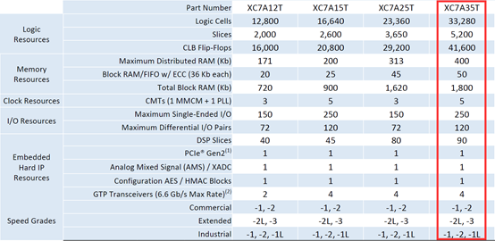

**2 板卡供电**
---------------
EGo1提供两种供电方式：Type-C和外接直流电源。EGo1提供了一个Type-C接口，功能为UART和JTAG，该接口可以用于为板卡供电。板卡上提供电压转换电路将Type-C输入的5V电压转换为板卡上各类芯片需要的工作电压。上电成功后红色LED灯（D18）点亮。

**3 系统时钟**
---------------
EGo1搭载一个100MHz的时钟芯片，输出的时钟信号直接与FPGA全局时钟输入引脚（P17）相连。若设计中还需要其他频率的时钟，可以采用FPGA内部的MMCM生成。

+---------+---------------+-------------+
|名称     |原理图标号     |FPGA IO PIN  |
+=========+===============+=============+
|时钟引脚 |SYS_CLK        |P17          |
+---------+---------------+-------------+
**4 FPGA配置**
--------------
EGo1在开始工作前必须先配置FPGA，板上提供以下方式配置FPGA：

- USB转JTAG接口J6
- 6-pin JTAG连接器接口J3
- SPI Flash上电自启动

FPGA的配置文件为后缀名.bit的文件，用户可以通过上述的三种方法将该bit文件烧写到FPGA中，该文件可以通过Vivado工具生成，BIT文件的具体功能由用户的原始设计文件决定。

在使用SPI Flash配置FPGA时，需要提前将配置文件写入到Flash中。Xilinx开发工具Vivado提供了写入Flash的功能。板上SPI Flash型号为N25Q32，支持3.3V电压配置。FPGA配置成功后D24将点亮。

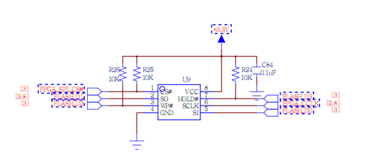
**5 通用I/O接口**
------------------
通用I/O接口外设包括2个专用按键、5个通用按键、8个拨码开关、1个8位DIP开关、16个LED灯、8个七段数码管。

**5.1 按键**
~~~~~~~~~~~~
两个专用按键分别用于逻辑复位RST（S6）和擦除FPGA配置PROG（S5），当设计中不需要外部触发复位时，RST按键可以用作其他逻辑触发功能。

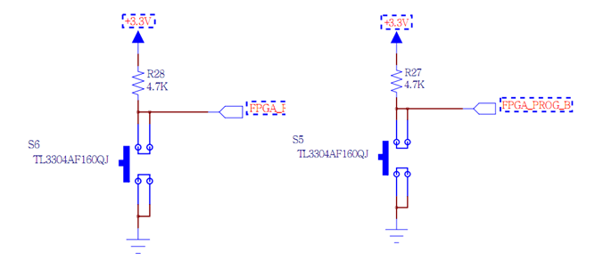

+---------+---------------+-------------+
|名称     |原理图标号     |FPGA IO PIN  |
+=========+===============+=============+
|复位引脚 |FPGA_RESET     |P15          |
+---------+---------------+-------------+

五个通用按键，默认为低电平，按键按下时输出高电平。

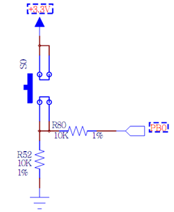

管脚约束如下：

+-----------+------------+---------------+
|名称       |原理图标号  |FPGA IO PIN    |
+===========+============+===============+
|S0         |PB0         |R11            |
+-----------+------------+---------------+
|S1         |PB1         |R17            |
+-----------+------------+---------------+
|S2         |PB2         |R15            |
+-----------+------------+---------------+
|S3         |PB3         |V1             |
+-----------+------------+---------------+
|S4         |PB4         |U4             |
+-----------+------------+---------------+

**5.2 开关**
~~~~~~~~~~~~~
开关包括8个拨码开关和一个8位DIP开关。

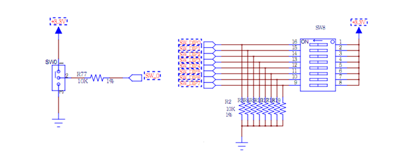

管脚约束如下：

+--------------+----------------+---------------+
|名称          |原理图标号      |FPGA IO PIN    |
+==============+================+===============+
|SW0           |SW_0            |P5             |
+--------------+----------------+---------------+
|SW1           |SW_1            |P4             |
+--------------+----------------+---------------+
|SW2           |SW_2            |P3             |
+--------------+----------------+---------------+
|SW3           |SW_3            |P2             |
+--------------+----------------+---------------+
|SW4           |SW_4            |R2             |
+--------------+----------------+---------------+
|SW5           |SW_5            |M4             |
+--------------+----------------+---------------+
|SW6           |SW_6            |N4             |
+--------------+----------------+---------------+
|SW7           |SW_7            |R1             |
+--------------+----------------+---------------+
|SW8           |SW_DIP0         |U3             |
+              +----------------+---------------+
|              |SW_DIP1         |U2             |
+              +----------------+---------------+
|              |SW_DIP2         |V2             |
+              +----------------+---------------+
|              |SW_DIP3         |V5             |
+              +----------------+---------------+
|              |SW_DIP4         |V4             |
+              +----------------+---------------+
|              |SW_DIP5         |R3             |
+              +----------------+---------------+
|              |SW_DIP6         |T3             |
+              +----------------+---------------+
|              |SW_DIP7         |T5             |
+--------------+----------------+---------------+

**5.3 LED灯**
~~~~~~~~~~~~~~
LED在FPGA输出高电平时被点亮。

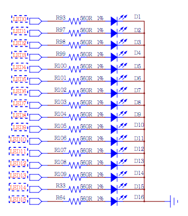

管脚约束如下：

+------------+--------------+---------------+---------------+
|名称        |原理图标号    |FPGA IO PIN    |颜色           |
+============+==============+===============+===============+
|D0          |LED0          |F6             |Green          |
+------------+--------------+---------------+---------------+
|D1          |LED1          |G4             |Green          |
+------------+--------------+---------------+---------------+
|D2          |LED2          |G3             |Green          |
+------------+--------------+---------------+---------------+
|D3          |LED3          |J4             |Green          |
+------------+--------------+---------------+---------------+
|D4          |LED4          |H4             |Green          |
+------------+--------------+---------------+---------------+
|D5          |LED5          |J3             |Green          |
+------------+--------------+---------------+---------------+
|D6          |LED6          |J2             |Green          |
+------------+--------------+---------------+---------------+
|D7          |LED7          |K2             |Green          |
+------------+--------------+---------------+---------------+
|D8          |LED8          |K1             |Green          |
+------------+--------------+---------------+---------------+
|D9          |LED9          |H6             |Green          |
+------------+--------------+---------------+---------------+
|D10         |LED10         |H5             |Green          |
+------------+--------------+---------------+---------------+
|D11         |LED11         |J5             |Green          |
+------------+--------------+---------------+---------------+
|D12         |LED12         |K6             |Green          |
+------------+--------------+---------------+---------------+
|D13         |LED13         |L1             |Green          |
+------------+--------------+---------------+---------------+
|D14         |LED14         |M1             |Green          |
+------------+--------------+---------------+---------------+
|D15         |LED15         |K3             |Green          |
+------------+--------------+---------------+---------------+ 

**5.4 七段数码管**
~~~~~~~~~~~~~~~~~~~~
数码管为共阴极数码管，即公共极输入低电平。共阴极由三极管驱动，FPGA需要提供正向信号。同时段选端连接高电平，数码管上的对应位置才可以被点亮。因此，FPGA输出有效的片选信号和段选信号都应该是高电平。

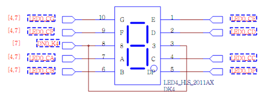

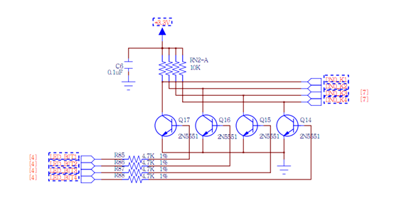

+------------+--------------+---------------+
|名称        |原理图标号    |FPGA IO PIN    |
+============+==============+===============+
|A0          |LED0_CA       |B4             |
+------------+--------------+---------------+
|B0          |LED0_CB       |A4             |
+------------+--------------+---------------+
|C0          |LED0_CC       |A3             |
+------------+--------------+---------------+
|D0          |LED0_CD       |B1             |
+------------+--------------+---------------+
|E0          |LED0_CE       |A1             |
+------------+--------------+---------------+
|F0          |LED0_CF       |B3             |
+------------+--------------+---------------+
|G0          |LED0_CG       |B2             |
+------------+--------------+---------------+
|DP0         |LED0_DP       |D5             |
+------------+--------------+---------------+
|A1          |LED1_CA       |D4             |
+------------+--------------+---------------+
|B1          |LED1_CB       |E3             |
+------------+--------------+---------------+
|C1          |LED1_CC       |D3             |
+------------+--------------+---------------+
|D1          |LED1_CD       |F4             |
+------------+--------------+---------------+
|E1          |LED1_CE       |F3             |
+------------+--------------+---------------+
|F1          |LED1_CF       |E2             |
+------------+--------------+---------------+
|G1          |LED1_CG       |D2             |
+------------+--------------+---------------+
|DP1         |LED1_DP       |H2             |
+------------+--------------+---------------+
|DN0_K1      |LED_BIT1      |G2             |
+------------+--------------+---------------+
|DN0_K2      |LED_BIT2      |C2             |
+------------+--------------+---------------+
|DN0_K3      |LED_BIT3      |C1             |
+------------+--------------+---------------+
|DN0_K4      |LED_BIT4      |H1             |
+------------+--------------+---------------+
|DN1_K1      |LED_BIT5      |G1             |
+------------+--------------+---------------+
|DN1_K2      |LED_BIT6      |F1             |
+------------+--------------+---------------+
|DN1_K3      |LED_BIT7      |E1             |
+------------+--------------+---------------+
|DN1_K4      |LED_BIT8      |G6             |
+------------+--------------+---------------+

**6 VGA接口**
-------------
EGo1上的VGA接口（J1）通过14位信号线与FPGA连接，红、绿、蓝三个颜色信号各占4位，另外还包括行同步和场同步信号。

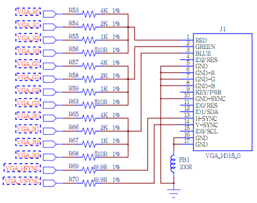

管脚约束如下：

+------------+--------------+---------------+
|名称        |原理图标号    |FPGA IO PIN    |
+============+==============+===============+
|RED         |VGA_RO        |F5             |
+            +--------------+---------------+
|            |VGA_R1        |C6             |
+            +--------------+---------------+
|            |VGA_R2        |C5             |
+            +--------------+---------------+
|            |VGA_R3        |B7             |
+------------+--------------+---------------+
|GREEN       |VGA_G0        |B6             |
+            +--------------+---------------+
|            |VGA_G1        |A6             |
+            +--------------+---------------+
|            |VGA_G2        |A5             |
+            +--------------+---------------+
|            |VGA_G3        |D8             |
+------------+--------------+---------------+
|BLUE        |VGA_B0        |C7             |
+            +--------------+---------------+
|            |VGA_B1        |E6             |
+            +--------------+---------------+
|            |VGA_B2        |E5             |
+            +--------------+---------------+
|            |VGA_B3        |E7             |
+------------+--------------+---------------+
|H-SYNC      |VGA_HSYNC     |D7             |
+------------+--------------+---------------+
|V-SYNC      |VGA_VSYNC     |C4             |
+------------+--------------+---------------+

**7 音频接口**
--------------
EGo1上的单声道音频输出接口（J12）由下图所示的低通滤波器电路驱动。滤波器的输入信号（AUDIO_PWM）是由FPGA产生的脉冲宽度调制信号（PWM）或脉冲密度调制信号（PDM）。低通滤波器将输入的数字信号转化为模拟电压信号输出到音频插孔上。

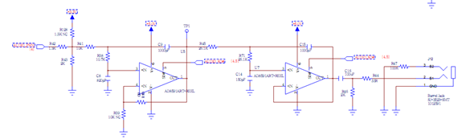

**脉冲宽度调制**
~~~~~~~~~~~~~~~~
脉冲宽度调制信号是一连串频率固定的脉冲信号，每个脉冲的宽度都可能不同。这种数字信号在通过一个简单的低通滤波器后，被转化为模拟电压信号，电压的大小跟一定区间内的平均脉冲宽度成正比。这个区间由低通滤波器的3dB截止频率和脉冲频率共同决定。例如，脉冲为高电平的时间占有效脉冲周期的10%的话，滤波电路产生的模拟电压值就是Vdd电压的十分之一。

下图是一个简单的PWM信号波形：

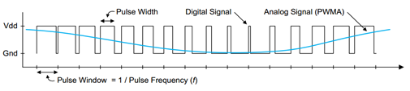

低通滤波器3dB频率要比PWM信号频率低一个数量级，这样PWM频率上的信号能量才能从输入信号中过滤出来。例如，要得到一个最高频率为5KHz的音频信号，那么PWM信号的频率至少为50KHz或者更高。通常，考虑到模拟信号的保真度，PWM信号的频率越高越好。下图是PWM信号整合之后输出模拟电压的过程示意图，可以看到滤波器输出信号幅度与Vdd的比值等于PWM信号的占空比。

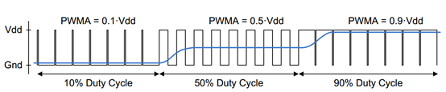

管脚约束如下：

+------------+--------------+---------------+
|名称        |原理图标号    |FPGA IO PIN    |
+============+==============+===============+
|AUDIO PWM   |AUDIO_PWM     |T1             |
+------------+--------------+---------------+
|AUDIO SD    |SUDIO_SD#     |M6             |
+------------+--------------+---------------+

**8 USB-UART/JTAG接口**
-----------------------
该模块将UART/JTAG转换成USB接口。用户可以非常方便的直接采用USB线缆连接板卡与PC机USB接口，通过Xilinx的配置软件如Vivado完成对板卡的配置。同时也可以通过串口功能与上位机进行通信。

管脚约束如下:

+------------+--------------+----------------------+
|名称        |原理图标号    |FPGA IO PIN           |
+============+==============+======================+
|UART RX     |UART_RX       |T4（FPGA串口发送端）  |
+------------+--------------+----------------------+
|UART TX     |UART_TX       |N5（FPGA串口接收端）  |
+------------+--------------+----------------------+

UATR的全称是通用异步收发器，是实现设备之间低速数据通信的标准协议。“异步”指不需要额外的时钟线进行数据的同步传输，双方约定在同一个频率下收发数据，此接口只需要两条信号线（RXD、TXD）就可以完成数据的相互通信，接收和发送可以同时进行，也就是全双工。

收发的过程，在发送器空闲时间，数据线处于逻辑1状态，当提示有数据要传输时，首先使数据线的逻辑状态为低，之后是8个数据位、一位校验位、一位停止位，校验一般是奇偶校验，停止位用于标示一帧的结束，接收过程亦类似，当检测到数据线变低时，开始对数据线以约定的频率抽样，完成接收过程。本例数据帧采用：无校验位，停止位为一位。

UART的数据帧格式，如下：

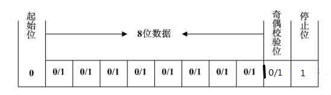

**9 USB转PS2接口**
-----------------------
为方便用户直接使用键盘鼠标，EGo1直接支持USB键盘鼠标设备。用户可将标准的USB键盘鼠标设备直接接入板上J4 USB接口，通过PIC24FJ128，转换为标准的PS/2协议接口。该接口不支持USB集线器，只能连接一个鼠标或键盘。鼠标和键盘通过标准的PS/2接口信号与FPGA进行通信。

管脚约束如下：

+------------------+--------------+---------------+
|PIC24J128标号     |原理图标号    |FPGA IO PIN    |
+------------------+--------------+---------------+
|15                |PS2_CLK       |K5             |
+------------------+--------------+---------------+
|12                |PS2_DATA      |L4             |
+------------------+--------------+---------------+

**10 SRAM接口**
-------------------
板卡搭载的IS61WV12816BLL SRAM 芯片，总容量2Mbit。该SRAM为异步式SRAM，最高存取时间可达8ns。操控简单，易于读写。

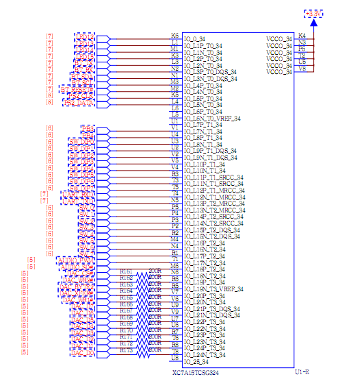

SRAM写操作时序如下（详细请参考SRAM用户手册）：

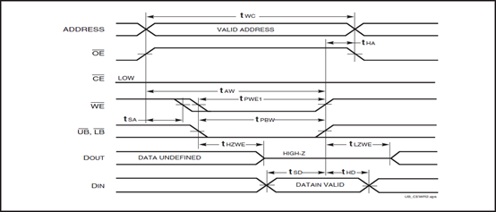

SRAM读操作时序如下（详细请参考SRAM用户手册）：

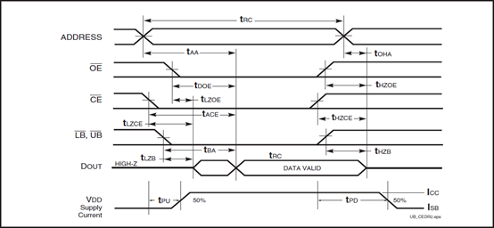

管脚约束如下：

+------------+--------------+---------------+
|SRAM引脚标号|原理图标号    |FPGA IO PIN    |
+============+==============+===============+
|I/O0        |MEM_D0        |U17            |
+------------+--------------+---------------+
|I/O1        |MEM_D1        |U18            |
+------------+--------------+---------------+
|I/O2        |MEM_D2        |U16            |
+------------+--------------+---------------+
|I/O3        |MEM_D3        |V17            |
+------------+--------------+---------------+
|I/O4        |MEM_D4        |T11            |
+------------+--------------+---------------+
|I/O5        |MEM_D5        |U11            |
+------------+--------------+---------------+
|I/O6        |MEM_D6        |U12            |
+------------+--------------+---------------+
|I/O7        |MEM_D7        |V12            |
+------------+--------------+---------------+
|I/O8        |MEM_D8        |V10            |
+------------+--------------+---------------+
|I/O9        |MEM_D9        |V11            |
+------------+--------------+---------------+
|I/O10       |MEM_D10       |U14            |
+------------+--------------+---------------+
|I/O11       |MEM_D11       |V14            |
+------------+--------------+---------------+
|I/O12       |MEM_D12       |T13            |
+------------+--------------+---------------+
|I/O13       |MEM_D13       |U13            |
+------------+--------------+---------------+
|I/O14       |MEM_D14       |T9             |
+------------+--------------+---------------+
|I/O15       |MEM_D15       |T10            |
+------------+--------------+---------------+
|A00         |MEM_A00       |T15            |
+------------+--------------+---------------+
|A01         |MEM_A01       |T14            |
+------------+--------------+---------------+
|A02         |MEM_A02       |N16            |
+------------+--------------+---------------+
|A03         |MEM_A03       |N15            |
+------------+--------------+---------------+
|A04         |MEM_A04       |M17            |
+------------+--------------+---------------+
|A05         |MEM_A05       |M16            |
+------------+--------------+---------------+
|A06         |MEM_A06       |P18            |
+------------+--------------+---------------+
|A07         |MEM_A07       |N17            |
+------------+--------------+---------------+
|A08         |MEM_A08       |P14            |
+------------+--------------+---------------+
|A09         |MEM_A09       |N14            |
+------------+--------------+---------------+
|A10         |MEM_A10       |T18            |
+------------+--------------+---------------+
|A11         |MEM_A11       |R18            |
+------------+--------------+---------------+
|A12         |MEM_A12       |M13            |
+------------+--------------+---------------+
|A13         |MEM_A13       |R13            |
+------------+--------------+---------------+
|A14         |MEM_A14       |R12            |
+------------+--------------+---------------+
|A15         |MEM_A15       |M18            |
+------------+--------------+---------------+
|A16         |MEM_A16       |L18            |
+------------+--------------+---------------+
|A17         |MEM_A17       |L16            |
+------------+--------------+---------------+
|A18         |MEM_A18       |L15            |
+------------+--------------+---------------+
|OE          |SRAM_OE#      |T16            |
+------------+--------------+---------------+
|CE          |SRAM_CE#      |V15            |
+------------+--------------+---------------+
|WE          |SRAM_WE#      |V16            |
+------------+--------------+---------------+
|UB          |SRAM_UB       |R16            |
+------------+--------------+---------------+
|LB          |SRAM_LB       |R10            |
+------------+--------------+---------------+

**11 模拟电压输入**
-------------------------
Xilinx 7系列的FPGA芯片内部集成了两个12bit位宽、采样率为1MSPS的ADC，拥有多达17个外部模拟信号输入通道，为用户的设计提供了通用的、高精度的模拟输入接口。

下图是XADC模块的框图：

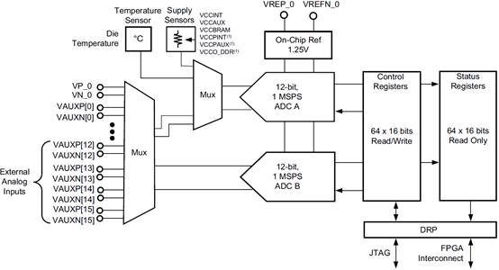

XADC模块有一专用的支持差分输入的模拟通道输入引脚(VP/VN)，另外还最多有16个辅助的模拟通道输入引脚（ADxP和ADxN，x为0到15）。

XADC模块也包括一定数量的片上传感器用来测量片上的供电电压和芯片温度，这些测量转换数据存储在一个叫状态寄存器（status registers）的专用寄存器内，可由FPGA内部叫动态配置端口（Dynamic Reconfiguration Port (DRP)）的16位的同步读写端口访问。 ADC转换数据也可以由JTAG TAP访问，这种情况下并不需要去直接例化XADC模块，因为这是一个已经存在于FPGA JTAG结构的专用接口。此时因为没有在设计中直接例化XADC模块，XADC模块就工作在一种预先定义好的模式叫缺省模式，缺省模式下XADC模块专用于监视芯片上的供电电压和芯片温度。

XADC模块的操作模式是由用户通过DRP或JTAG接口写控制寄存器来选择的，控制寄存器的初始值有可能在设计中例化XADC模块时的块属性（block attributes）指定。模式选择是由控制寄存器41H的SEQ3到SEQ0比特决定，具体如下图示：

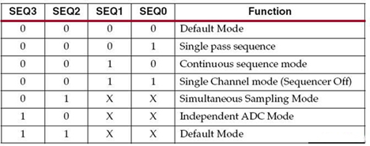

XADC模块的使用方法，一是直接用FPGA JTAG专用接口访问，这时XADC模块工作在缺省模式；二是在设计中例化XADC模块，这是可以通过FPGA逻辑或ZYNQ器件的PS到ADC模块的专用接口访问。（详细请参考XADC用户手册ug480_7Series_XADC.pdf）

EGo1通过电位器（W1）向FPGA提供模拟电压输入，输入的模拟电压随着电位器的旋转在0 ~ 1V之间变化。输入的模拟信号与FPGA的C12引脚相连，最终通过通道1输入到内部ADC。

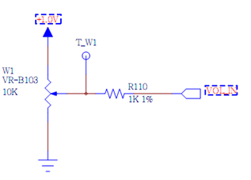

**12 DAC输出接口**
-------------------
EGo1上集成了8位的模数转换芯片（DAC0832），DAC输出的模拟信号连接到接口J2上。

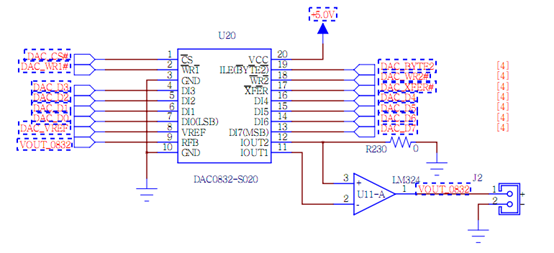

下面是DAC0832的操作时序图（详细请参考DAC0832用户手册）

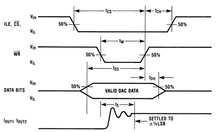

管脚约束如下:

+-----------------+--------------+---------------+
|DAC0832引脚标号  |原理图标号    |FPGA IO PIN    |
+=================+==============+===============+
|DI0              |DAC_D0        |T8             |
+-----------------+--------------+---------------+
|DI1              |DAC_D1        |R8             |
+-----------------+--------------+---------------+
|DI2              |DAC_D2        |T6             |
+-----------------+--------------+---------------+
|DI3              |DAC_D3        |R7             |
+-----------------+--------------+---------------+
|DI4              |DAC_D4        |U6             |
+-----------------+--------------+---------------+
|DI5              |DAC_D5        |U7             |
+-----------------+--------------+---------------+
|DI6              |DAC_D6        |V9             |
+-----------------+--------------+---------------+
|DI7              |DAC_D7        |U9             |
+-----------------+--------------+---------------+
|ILE(BYTE2)       |DAC_BYTE2     |R5             |
+-----------------+--------------+---------------+
|CS               |DAC_CS#       |N6             |
+-----------------+--------------+---------------+
|WR1              |DAC_WR1#      |V6             |
+-----------------+--------------+---------------+
|WR2              |DAC_WR2#      |R6             |
+-----------------+--------------+---------------+
|XFER             |DAC_XFER#     |V7             |
+-----------------+--------------+---------------+

**13 蓝牙模块**
-----------------
EGo1上集成了蓝牙模块（BLE-CC41-A），FPGA通过串口和蓝牙模块进行通信。波特率支持1200，2400，4800，9600，14400，19200，38400，57600，115200和230400bps。串口缺省波特率为9600bps。该模块支持AT命令操作方法。

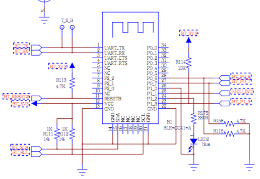

管脚约束如下:

+-----------------+--------------+-----------------------+
|BLE-CC41-A标号   |原理图标号    |FPGA IO PIN            |
+=================+==============+=======================+
|UART_RX          |BT_RX         |N2（FPGA串口发送端）   |
+-----------------+--------------+-----------------------+
|UART_TX          |BT_TX         |L3（FPGA串口接收端）   |
+-----------------+--------------+-----------------------+

**14 通用扩展I/O**
----------------------
EGo1上为用户提供了灵活的通用接口（J5）用来作I/O扩展，共提供32个双向IO，每个IO支持过流过压保护。

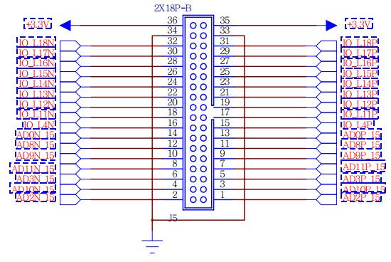

管脚约束如下：

+------------+--------------+---------------+
|2x18标号    |原理图标号    |FPGA IO PIN    |
+============+==============+===============+
|1           |AD2P_15       |B16            |
+------------+--------------+---------------+
|2           |AD2N_15       |B17            |
+------------+--------------+---------------+
|3           |AD10P_15      |A15            |
+------------+--------------+---------------+
|4           |AD10N_15      |A16            |
+------------+--------------+---------------+
|5           |AD3P_15       |A13            |
+------------+--------------+---------------+
|6           |AD3N_15       |A14            |
+------------+--------------+---------------+
|7           |AD11P_15      |B18            |
+------------+--------------+---------------+
|8           |AD11N_15      |A18            |
+------------+--------------+---------------+
|9           |AD9P_15       |F13            |
+------------+--------------+---------------+
|10          |AD9N_15       |F14            |
+------------+--------------+---------------+
|11          |AD8P_15       |B13            |
+------------+--------------+---------------+
|12          |AD8N_15       |B14            |
+------------+--------------+---------------+
|13          |AD0P_15       |D14            |
+------------+--------------+---------------+
|14          |AD0N_15       |C14            |
+------------+--------------+---------------+
|15          |IO_L4P        |B11            |
+------------+--------------+---------------+
|16          |IO_L4N        |A11            |
+------------+--------------+---------------+
|17          |IO_L11P       |E15            |
+------------+--------------+---------------+
|18          |IO_L11N       |E16            |
+------------+--------------+---------------+
|19          |IO_L12P       |D15            |
+------------+--------------+---------------+
|20          |IO_L12N       |C15            |
+------------+--------------+---------------+
|21          |IO_L13P       |H16            |
+------------+--------------+---------------+
|22          |IO_L13N       |G16            |
+------------+--------------+---------------+
|23          |IO_L14P       |F15            |
+------------+--------------+---------------+
|24          |IO_L14N       |F16            |
+------------+--------------+---------------+
|25          |IO_L15P       |H14            |
+------------+--------------+---------------+
|26          |IO_L15N       |G14            |
+------------+--------------+---------------+
|27          |IO_L16P       |E17            |
+------------+--------------+---------------+
|28          |IO_L16N       |D17            |
+------------+--------------+---------------+
|29          |IO_L17P       |K13            |
+------------+--------------+---------------+
|30          |IO_L17N       |J13            |
+------------+--------------+---------------+
|31          |IO_L18P       |H17            |
+------------+--------------+---------------+
|32          |IO_L18N       |G17            |
+------------+--------------+---------------+

	

.. toctree::
   :maxdepth: 2

