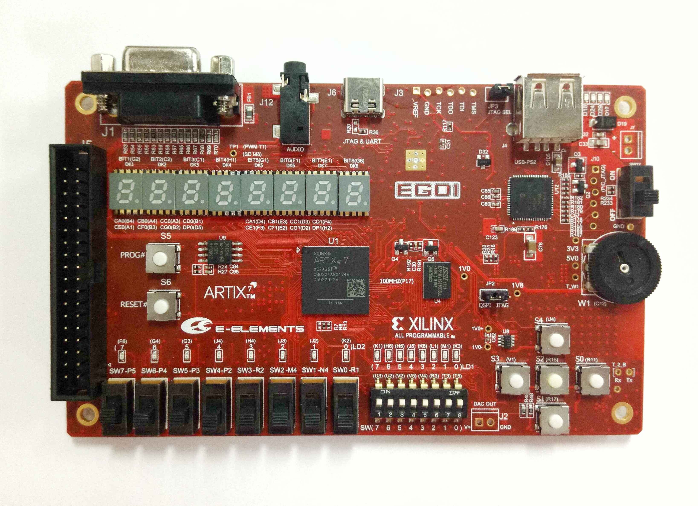

**概述** 
==================

EGo1是依元素科技基于Xilinx Artix-7 FPGA研发的便携式数模混合基础教学平台。EGo1配备的FPGA (XC7A35T-1CSG324C)具有大容量高性能等特点，能实现较复杂的数字逻辑设计；在FPGA内可以构建MicroBlaze处理器系统，可进行SoC设计。该平台拥有丰富的外设，以及灵活的通用扩展接口。

平台外设概览：

+-----+-------------------+-----+------------------+
|编号 |描述               |编号 |描述              |
+=====+===================+=====+==================+
|1    |VGA接口            |10   |1个模拟电压输入   |
+-----+-------------------+-----+------------------+
|2    |音频接口           |11   |1个DAC输出接口    |
+-----+-------------------+-----+------------------+
|3    |USB转UART/JTAG接口 |12   |SRAM存储器        |
+-----+-------------------+-----+------------------+
|4    |USB转PS2接口       |13   |SPI FLASH存储器   |
+-----+-------------------+-----+------------------+
|5    |2个4位数码管       |14   |蓝牙模块          |
+-----+-------------------+-----+------------------+
|6    |16个LED灯          |15   |通用扩展接口      |
+-----+-------------------+-----+------------------+
|7    |8个拔码开关        |     |                  |
+-----+-------------------+-----+------------------+
|8    |1个8位DIP开关      |     |                  |
+-----+-------------------+-----+------------------+
|9    |5个按键            |     |                  |
+-----+-------------------+-----+------------------+

	

.. toctree::
   :maxdepth: 2

